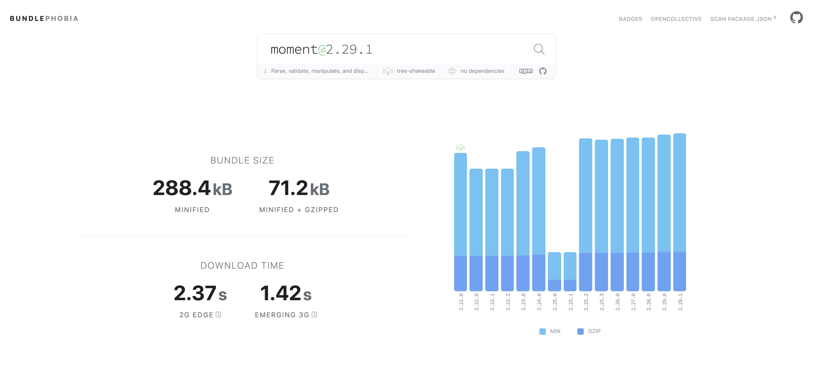
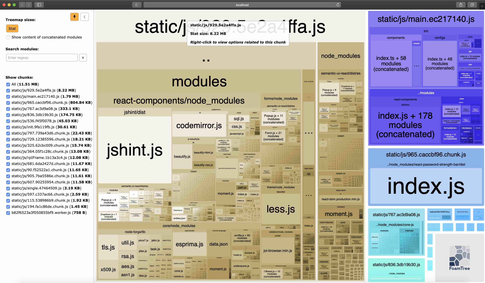
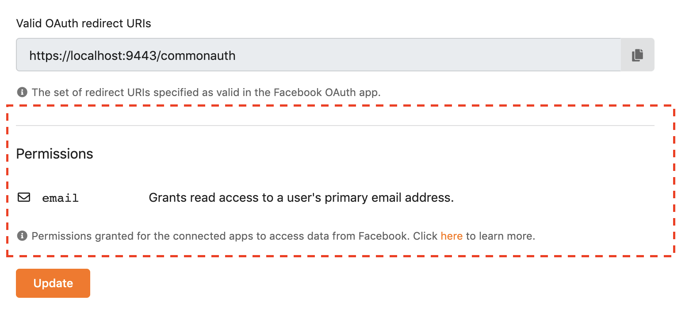

# Developer Guide

This guide contains instructions on developing features/fixes for WSO2 Identity Apps. Use this as a handbook for
submitting PRs.

* [Prerequisites](#prerequisites)
* [Setting up Development Tools](#setting-up-development-tools)
* [Setting up the Source Code](#setting-up-the-source-code)
* [Bootstrapping the project](#bootstrapping-the-project)
    * [Install npm and Lerna modules](#install-npm-and-lerna-modules)
    * [Bootstrap and hoist common dependencies](#bootstrap-and-hoist-common-dependencies)
* [Building the project](#building-the-project)
* [Configuration Guide](#configuration-guide)
* [Writing Code](#writing-code)
    * [Ensuring Code Quality](#ensuring-code-quality)
    * [Formatting](#formatting)
    * [Ensuring performance](#ensuring-performance)
    * [Ensuring a good user experience](#ensuring-a-good-user-experience)
* [Styling](#styling)
    * [Forms](#forms)
* [Writing Tests](#writing-tests)
    * [Unit Tests](#unit-tests)
    * [Integration Tests](#integration-tests)
* [Troubleshoot](#troubleshoot)

See the [contribution guidelines](../CONTRIBUTING.md)
if you'd like to contribute to Identity Apps.

## Prerequisites

Before you can build and write code, make sure you have the following set of tools on your local environment:

* [Git](https://git-scm.com/downloads) - Open source distributed version control system. For install instructions, refer [this](https://www.atlassian.com/git/tutorials/install-git).

* [Node.js](https://nodejs.org/en/download/) - JavaScript runtime with node package manager ([npm](https://www.npmjs.com/)).

* [Maven](https://maven.apache.org/download.cgi) - Build automation tool for Java projects. * For Maven 3.8 and up, please check the [Troubleshoot section](#build-failures).

* [Java Development Kit 1.8](https://www.oracle.com/java/technologies/javase/javase-jdk8-downloads.html) - Development environment for building applications using the Java programming language.

## Setting up Development Tools

### React Developer Tools

Browser extension to debug React code.

- [Download for Chrome](https://chrome.google.com/webstore/detail/react-developer-tools/fmkadmapgofadopljbjfkapdkoienihi?hl=en)
- [Download for Firefox](https://addons.mozilla.org/en-US/firefox/addon/react-devtools/)

### Redux DevTools

Redux DevTools for debugging application's Redux store operations.

- [Download for Chrome](https://chrome.google.com/webstore/detail/redux-devtools/lmhkpmbekcpmknklioeibfkpmmfibljd?hl=en)
- [Download for Firefox](https://addons.mozilla.org/en-US/firefox/addon/reduxdevtools/)

### ESLint

ESLint is a static code analysis tool for identifying problematic patterns found in JavaScript/Typescript code.

Make sure you setup the supplementary plugins in your IDE of choice.

#### Webstorm

WebStorm shows warnings and errors reported by ESLint right in the editor, as you type.

- [Install the plugin](https://www.jetbrains.com/help/webstorm/eslint.html)

#### VS Code

Integrates ESLint into VS Code. The extension uses the ESLint library installed in the opened workspace folder.

- [Install the plugin](https://marketplace.visualstudio.com/items?itemName=dbaeumer.vscode-eslint)

## Setting up the Source Code

1. [Fork](https://docs.github.com/en/github/getting-started-with-github/fork-a-repo) the repository.
2. Clone your fork to the local machine.

Replace `<github username>` with your own username.

```shell
git clone https://github.com/<github username>/identity-apps.git
```

3. Set the original repo as the upstream remote.

```shell
git remote add upstream https://github.com/wso2/identity-apps.git
```

## Bootstrapping the project

Usually, running the build command would automatically install all the dependencies.

In-case you want to manually do this, execute the following commands accordingly.

### Install npm and Lerna modules

Runs npm install & npx lerna bootstrap which will bootstrap all the Lerna modules. Use this mode for development.

```shell
npm run bootstrap
```

### Bootstrap and hoist common dependencies

This is the mode used in the production build. Learn more about Lerna hoisting [here](https://github.com/lerna/lerna/blob/main/doc/hoist.md).

```shell
npm run bootstrap:hoist
```

## Building the project

We support the following set of build strategies.

### Building using Maven

Run the following command from the root of the project (where the root `pom.xml` is located).

```shell
# Hoists and boostraps the dependecies & builds the entire project including the JSP portals.
mvn clean install
```

### Building using NPM

Run the following command from the root of the project (where the root `package.json` is located).

```shell
# Boostraps the dependecies & builds the node projects.
npm run build:dev
```

## Configuration Guide

The portals i.e. Console & My Account are configurable using the `deployment.toml` when they are hosted inside the Identity Server.
Read through our [configurations guidelines](./CONFIGURATION.md) to learn about the configuration process.

## Writing Code

### Ensuring Code Quality

Make sure that you set up the required developer tools as mentioned [here](#setting-up-development-tools) before
starting off with the coding.

#### Static Code Analysis

Follow through [this guide](./STATIC_CODE_ANALYSIS.md) to set-up and understand the different static code analysis tools that are being used in the project.

### React Rules of Thumb

#### Writing Components

##### Conditional Rendering

The return from an component should always be a `ReactElement` or `null`. Always be careful when doing
[conditional rendering][react-conditional-rendering] with `&&` operator. If the component returns undefined, React
will break the rendering as of now.

:white_check_mark: Do

```typescript
export const SignOnMethods: FunctionComponent<SignOnMethodsPropsInterface> = (
    props: SignOnMethodsPropsInterface
): ReactElement => {

    ...

    return (
        someCondition
            ? <SignOnMethodsContent />
            : null
    );
}
```

:x: Don't

```typescript
export const SignOnMethods: FunctionComponent<SignOnMethodsPropsInterface> = (
    props: SignOnMethodsPropsInterface
): ReactElement => {

    ...

    return someCondition && <SignOnMethodsContent />;
}
```

### Formatting

We have already added few [ESLint rules](../.eslintrc.js) to ensure consistent formatting across the entire codebase.
Please make sure you adhere to the specified rules and also follow the following set of common formatting practices while developing components.

#### Ternary Expressions

Typescript allows operands of ternary expressions to be separated by newlines, which can improve the readability of your program.

:white_check_mark: Do

**Single Line**

```typescript
foo > bar ? value1 : value1
```

**Multiline**

```typescript
foo > bar
    ? value1
    : value1
```

:x: Don't

```typescript
foo > bar ? value1
    : value1
```

### Ensuring performance

We care a lot about maintaining the performance of our applications. Hence, it is your duty to make sure that the code you
write follows the standards and does not diminish the existing performance levels.

In-order to ensure this, please follow the following steps while making your contributions.

#### Use code splitting

Webpack and React supports code splitting out of the box. Try to always leverage these features to reduce bundle size and performance.

- Read more about Webpack Code Splitting [here](https://webpack.js.org/guides/code-splitting/).
- Read more about React Code Splitting [here](https://reactjs.org/docs/code-splitting.html).

#### Take advantage of tree shaking

Webpack's treeshaking is a really awesome feature to get rid of dead code. Always try to take advantage of that.

:white_check_mark: Do

```typescript
import get from "lodash-es";
```

:x: Don't

```typescript
import * as _ from "lodash-es";
```

#### Don't write redundant code

Unnecessary code will bulk up the bundle without you even realizing. Always try to avoid scenarios like the following.

##### Redundant optional chain

:x: Don't

```typescript
if (user?.email && user?.email?.home) {
    ...
}
```

When the above block is transpiled, it is converted to the following.

```javascript
if ((user === null || user === void 0 ? void 0 : user.email) && ((_a = user === null || user === void 0 ? void 0 : user.email) === null || _a === void 0 ? void 0 : _a.home)) {
}
```

Notice that the first null check is redundant. It can be re-written as follows.

:white_check_mark: Do

```typescript
if (user?.email?.home) {
    ...
}
```

Following is the transpiled version of the above code block. The footprint is significantly less.

```javascript
if ((_a = user === null || user === void 0 ? void 0 : user.email) === null || _a === void 0 ? void 0 : _a.home) {
}
```

:bulb: Always remember, more characters means more bytes.

#### Carefully adding new dependencies

Dependencies carry a heavy wait and contribute in a significant amount for the overall bundle size. So, when adding a new
library to the project try to answer the following questions.

Q1. Is the library absolutely required?

In some cases, you will be able to manually write the code rather than using a library. But keep in mind not to re-invent the wheel as well.

Q2. Is the library actively maintained?

Go to the NPM registry and GitHub repository of the prospective library and check for stats like downloads, stars, last published dates,
issues etc. This will give you an understanding on the state of the library.

:bulb: Never add a dependency that is not actively maintained.

Q3. Have you considered other libraries?

Do a benchmark and test other related libraries.

Q4. What is the size of the library?

You can easily check the size of the library by using an online tool like [Bundlephobia](https://bundlephobia.com/).



Q5. What are the dependencies used inside the library?

Some library developers include relatively large dependencies like [`lodash`](https://lodash.com/), [`moment`](https://momentjs.com/) etc. in their libraries as dependencies.
Adding these will result in increase bundle sizes. Check in the `package.json` for the dependencies used inside the library.

Q6. What is the footprint introduced by the newly added library?

We have added a script to analyze the bundle sizes of our react applications using [Webpack Bundle Analyzer Plugin](https://www.npmjs.com/package/webpack-bundle-analyzer).

Use the following command to examine the footprint introduced by the prospective library.

##### Analyze for Console

:bulb: The analyzer will open in http://localhost:8889

```shell
npx lerna run build:analyze --scope @wso2is/console
```

##### Analyze for My Account

:bulb: The analyzer will open in http://localhost:8888

```shell
npx lerna run build:analyze --scope @wso2is/myaccount
```

Once you execute the above command, the resulting view will look something like the following.



#### Optimize static assets

When adding new assets, always check the existing once in the theme and only proceed if the desired asset is not available.

##### Adding Images

When adding images, always try to add SVGs which are optimized for web.

##### Prepend unused arguments with `_`

There might be times when you have to leave an argument unused in a function, especially when writing extension configs. This will prompt the linter to throw a warning.
To avoid this, always prepend the unused argument with `_`.
```TypeScript
const printAge(_name: string, age: number){
    console.log(age);
}
```

## Ensuring a good user experience
We follow certain development practices to ensure the applications provide a good user experience. Please make sure you adhere to the following guidelines.

### Disable submit buttons until the submission is complete
When the submit button in a form is clicked, usually an API call is sent to persist the changes. However, during the API call, if the submit button remains enabled, then the users will be able to click on it as many times as they want, which will result in multiple API calls.

To avoid this, disable the submit button until the API call is complete. While disabling the button, to provide a better UX, it is also advisable top show a loading indicator in the button.

```TypeScript
const SampleComponent = () => {
    const [isSubmitting, setIsSubmitting] = useState(false);

    const apiCall = (): void {
        setIsSubmitting(true);

        callAPI().then((response) => {
            // handle response
        }).error((error)=>{
            // handle error
        }).finally(()=>{
            setIsSubmitting(false);
        });
    }

    return (
        <div>
            <PrimaryButton loading={ isSubmitting } disabled={ loading }> Submit </PrimaryButton>
        </div>
    )
```
## Styling

### Forms
Always use the new [@wso2is/form](../modules/form) module when developing forms.

Read the documentation [here](./CONFIGURATION.md).

#### Sectioned Form

When styling the forms, avoid using any ad-hoc Headings, Dividers etc.
If you wish to write a form with sub sections, use the [FormSection](../modules/react-components/src/components/forms/form-section.tsx) component.
It will add a divider and a Heading with a constant emphasis level.

##### Usage

```tsx
<FormSection heading=“Permissions”>
    <Field.Input
        ariaLabel="scopes"
        inputType="text"
        name="scopes"
        …
    />
    <Field.Input
        ariaLabel="user data"
        inputType="text"
        name="userData"
        …
    />
<FormSection>
```

##### Output



## Writing Tests

### Unit Tests

Read the unit testing guide [here](testing/UNIT_TESTING.md)

### Integration Tests

Read the integration testing guide [here](testing/INTEGRATION_TESTING.md)

## Troubleshoot

### Maven

#### Build Failures

- If you face any out of memory build failures, make sure that you have set maven options to `set MAVEN_OPTS=-Xmx384M`
- For Maven v3.8 up, add below configuration to the `~/.m2/settings.xml` (Create a new file if the file exist)

```xml
<settings>
    <mirrors>
        <mirror>
            <id>wso2-nexus-public</id>
            <mirrorOf>external:http:*</mirrorOf>
            <url>http://maven.wso2.org/nexus/content/groups/wso2-public/</url>
            <blocked>false</blocked>
        </mirror>
        <mirror>
            <id>wso2-nexus-release</id>
            <mirrorOf>external:http:*</mirrorOf>
            <url>http://maven.wso2.org/nexus/content/repositories/releases/</url>
            <blocked>false</blocked>
        </mirror>
        <mirror>
            <id>wso2-nexus-snapshots</id>
            <mirrorOf>external:http:*</mirrorOf>
            <url>http://maven.wso2.org/nexus/content/repositories/snapshots/</url>
            <blocked>false</blocked>
        </mirror>
    </mirrors>
</settings>
```

[react-testing-library]: https://testing-library.com/docs/
[react-testing-library-custom-renderer]: https://testing-library.com/docs/react-testing-library/setup#custom-render
[react-conditional-rendering]: https://reactjs.org/docs/conditional-rendering.html
